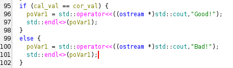
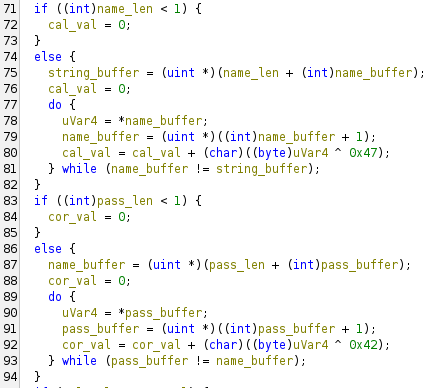

# Crackme1
so the first crack me is from [crackmy.app](https://crackmy.app/crackmes/crackme-1-by-batman10-by-crackmes-de-52733) by author *batman10_by_crackmes.de*

after extracting and running the executable , we can see it asks for two things `Name` and ` Password `

We open the executable in a decompiler (*I recommend [ghidra](https://github.com/NationalSecurityAgency/ghidra) if you want a free decompiler , otherwise binary ninja is great*)

In defined strings we search for any strings like "Good" or "cracked" or "Successful" , things like that.

from this we can see that if cal_val and cor_val are equal then its successful
> Note: Most variables are renamed for easier understanding , original might contain names like uvar5, povar10, etc.

The below code is what determines the value of cal_val and cor_val

The first 'if( )' block just XOR's each character in the name string with **'G'** (0x47 is the ASCII value of the character G)

The second block also XOR's each character in the password string with **'B'** 

So my solution for this is just use `Name` as G and `password` as B and it works!

> Also the decompiled result is hundreds of lines of code , so use the System tree section to move around between the necessary functions more efficiently.
