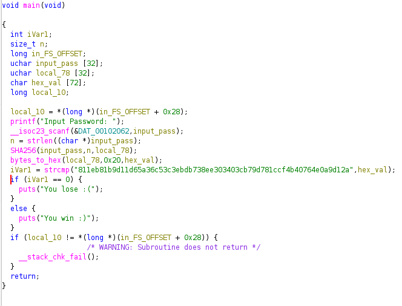
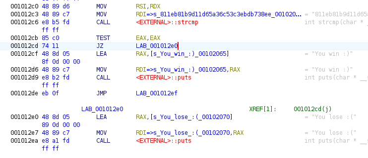

# Crackme2
So i got this exe online and ran it through our favourite ghidra

so our main funtion looked like this , most of the important things in main itself , strcmp , if condition as usual . 

But there is an important thing or rather a function , the **SHA256( )**. Now for those who dont know its a ***crypto-graphic hash function*** , put in a value of any length, it will spit out a 256bit hash of that value.

Now in strcmp( ) we can see the hardcoded expected key `811eb81b9d11d65a36c53c3ebdb738ee303403cb79d781ccf4b40764e0a9d12a`
One can think "we can just match the key to its value" but uh total possible sha256 values is 2^256 . So it would be a very long search even if you had a hash table of every combination 

Rather we will take a slight shortcut, into the assembler section.

We can see the CALL , which is calling external fn strcmp. Next we have TEST , then the important **JZ , which is "jump if zero"**.

Comparing decompiled code with assembler section , we can understand TEST is like if statement . If the condition is true CPU flags are set to 1 , else 0. So we will replace JZ with JNZ

Right-click on JZ and select "patch instruction"

Now we changed the jump condition itself , so that program fails only when flag is 0 , that is, only if comparision in strcmp succeded.

And every other scenario , every other string other than the original password , will crack this exe!

The power of patching is insane tbh..
