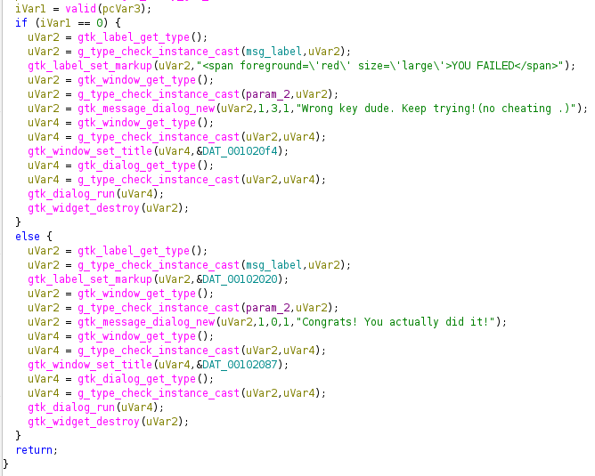
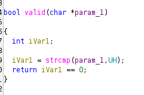
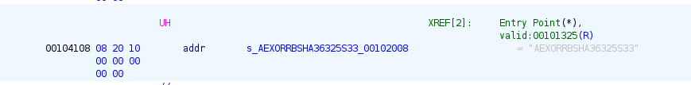

# Easy Crackmes 1
So we solved the [exe](https://crackmes.one/crackme/6963af82143c47935bdea9ab) from the [crackmes.one](https://crackmes.one/)

After decompilation , we will search for useful strings 

so here we can see that in a function named 'btn_clicked( )' we are deciding success and failure based on iVar1 , which gets its value from another function called 'valid( )'

Opening valid( ) function, its just using strcmp( ) with a global variable 'UH'

in the assembler section we can see the value of UH , which was hardcoded

So the key was `AEXORRBSHA36325S33`